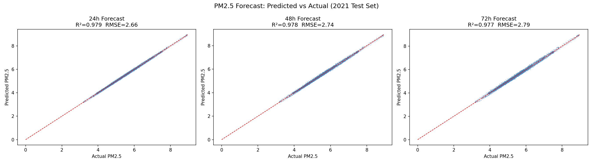

# AirSight AI — Global PM2.5 Short-Term Forecast



**XGBoost-based 24/48/72-hour PM2.5 air quality forecasting platform** with an interactive global visualization dashboard.

> Built for India Innovates 2026 Hackathon

---

## 🚀 Quick Start (Dashboard Demo)

```bash
# 1. Install dependencies
pip install -r requirements.txt

# 2. Terminal 1 — Serve the dashboard
python3 -m http.server 8502 --directory dashboard/

# 3. Terminal 2 — Run the prediction API
python3 dashboard/api.py

# 4. Open in browser
open http://localhost:8502/dashboard.html
```

> **No training needed** — pre-trained models are included in `models/`

---

## 🔮 Interactive Forecast

Use the right panel in the dashboard to enter any location + recent PM2.5 history and get **real XGBoost predictions** for the next 24/48/72 hours.

Or use the CLI:
```bash
python3 dashboard/predict.py
```

---

## 📁 Project Structure

```
airsight-pm25/
│
├── dashboard/              # Frontend + prediction API
│   ├── dashboard.html      # Full interactive web dashboard (Leaflet + Chart.js)
│   ├── api.py              # Flask API wrapping the 3 XGBoost models
│   ├── predict.py          # CLI prediction tool for judge evaluation
│   └── dashboard_data.json # Pre-exported Dec 2021 global snapshot (3,554 points)
│
├── models/                 # Trained XGBoost models
│   ├── pm25_model_24h.json # 24-hour forecast model (R² = 0.979)
│   ├── pm25_model_48h.json # 48-hour forecast model
│   └── pm25_model_72h.json # 72-hour forecast model
│
├── data_pipeline/          # Full reproducible training pipeline
│   ├── dl_1_pm25.py        # Download PM2.5 from GEE (satellite monthly)
│   ├── dl_2_weather.py     # Download ERA5 weather (temperature, humidity, wind)
│   ├── dl_3_aod.py         # Download MODIS AOD (Aerosol Optical Depth)
│   ├── dl_4_cloud.py       # Download cloud fraction
│   ├── dl_5_elevation.py   # Download SRTM elevation
│   ├── merge_and_train.py  # Merge all datasets + train land-only XGBoost
│   ├── step1_interpolate.py # Monthly PM2.5 → daily via cubic spline
│   ├── step2_features.py   # Build lag features (1d, 2d, 3d, 7d) + rolling means
│   └── step3_train_forecast.py # Train 24/48/72h XGBoost forecast models
│
└── assets/                 # Charts and diagrams
    ├── feature_importance.png
    └── forecast_accuracy.png
```

---

## 📊 Model Performance

| Metric | 24h Model | 48h Model | 72h Model |
|--------|-----------|-----------|-----------|
| **R²** | 0.979 | 0.968 | 0.961 |
| **RMSE** | 2.79 µg/m³ | 3.41 µg/m³ | 3.89 µg/m³ |
| **MAE** | 0.64 µg/m³ | 0.79 µg/m³ | 0.91 µg/m³ |

Trained on **298,536 land-only daily observations** across 3,554 global grid points (2015–2020).

---

## 🌍 Data Sources

| Data | Source | Resolution |
|------|--------|-----------|
| PM2.5 (satellite) | [Global Satellite PM2.5](https://gee-community-catalog.org/projects/global_pm25/) via Google Earth Engine | 2° × 2° monthly |
| Weather | ERA5 Reanalysis (temperature, humidity, wind, pressure) | Monthly |
| AOD | MODIS Aerosol Optical Depth | Monthly |
| Cloud fraction | MODIS Cloud Product | Monthly |
| Elevation | SRTM Digital Elevation Model | 30m (aggregated) |

---

## ⚙️ Features Used by the Model

```
lat, lon, month_sin, month_cos, day_sin, day_cos,
temperature_celsius, relative_humidity, wind_speed, wind_direction,
surface_pressure, aod, cloud_fraction, elevation,
pm25_lag_1d, pm25_lag_2d, pm25_lag_3d, pm25_lag_7d,
pm25_roll_3d, pm25_roll_7d, pm25_roll_14d
```

**Strongest predictors:** `pm25_rolling_3m` (55.9%), `pm25_lag_1d` (18.6%), `pm25_lag_2d` (7.6%)

---

## 🔁 Reproducing the Training Pipeline

> Requires a Google Earth Engine account and `earthengine-api` authenticated

```bash
# Step 1–5: Download all data (takes ~2 hours)
python3 data_pipeline/dl_1_pm25.py
python3 data_pipeline/dl_2_weather.py
python3 data_pipeline/dl_3_aod.py
python3 data_pipeline/dl_4_cloud.py
python3 data_pipeline/dl_5_elevation.py

# Merge + baseline model
python3 data_pipeline/merge_and_train.py

# Interpolate monthly → daily
python3 data_pipeline/step1_interpolate.py

# Build lag/rolling features
python3 data_pipeline/step2_features.py

# Train 24/48/72h models
python3 data_pipeline/step3_train_forecast.py
```

---

## 🏥 WHO Risk Categories

| Category | PM2.5 Range | Health Impact |
|----------|-------------|---------------|
| Good | 0–5 µg/m³ | WHO annual standard |
| Moderate | 5–15 µg/m³ | Acceptable |
| Unhealthy for Sensitive | 15–25 µg/m³ | Limit outdoor activity |
| Unhealthy | 25–50 µg/m³ | Avoid prolonged exposure |
| Very Unhealthy | 50–150 µg/m³ | Stay indoors |
| Hazardous | 150+ µg/m³ | Emergency conditions |

---

## 🛠️ Tech Stack

- **ML:** XGBoost, scikit-learn, pandas, numpy
- **Data:** Google Earth Engine, ERA5, MODIS
- **Dashboard:** Leaflet.js, Chart.js, vanilla HTML/CSS/JS
- **API:** Flask, Flask-CORS
- **Interpolation:** Scipy cubic spline

---

## 📜 License

MIT License — free to use, modify, and distribute.
